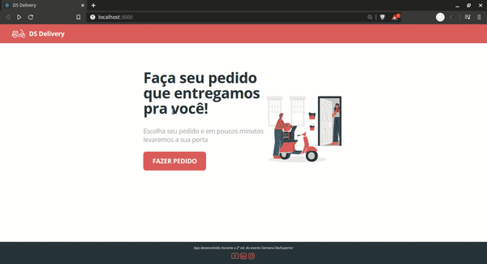

# DS Delivery - Semana DevSuperior 2

Repositório do projeto desenvolvido na semana DevSuperior 2, evento da DevSuperior.

## O projeto

O projeto consiste em uma aplicação web e um aplicativo de encomenda de produtos. A ideia é implementar o layout proposto, onde o usuário pode escolher produtos e uma localidade no mapa, e fazer um pedido de entrega.

## Tecnologias

As tecnologias utilizadas foram:
<strong>Back-end:</strong> Java com spring
<strong>Front-end:</strong> React Js
<strong>Mobile:</strong> React Native

## Resultado

O aplicativo web foi publicado [neste link](https://ds-deliver-sds2.netlify.app/), no netlify.
E o servidor back-end foi publicado [neste link](https://sds2-dsdeliver2021.herokuapp.com/), no heroku. O back-end só possui as rotas /orders e /products acessíveis.

## Como utilizar

### Back-end

Para rodar o back-end é necessário utilizar o aplicativo Spring Tool. É preciso abrir o repositório, e rodar como "spring boot app".

Além disso, é preciso alterar o arquivo "application.properties", utilizando spring.profiles.active = dev.

### Front-end

Para rodar o front-end é necessário apenas entrar na pasta e rodar o comando

```bash
npm install && npm start
```

#### Demonstração da versão web


